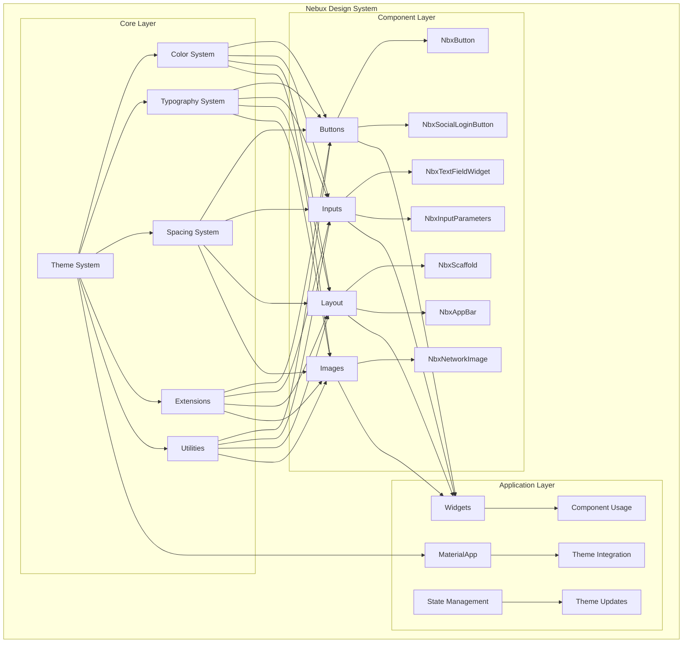
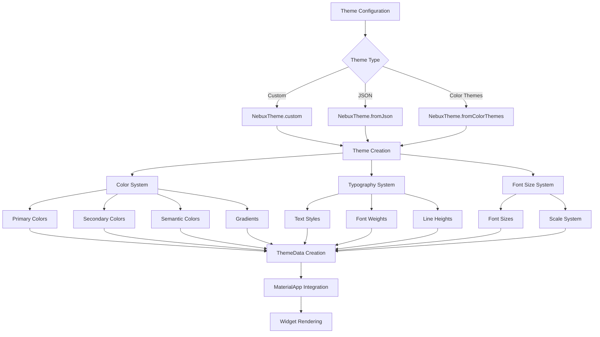
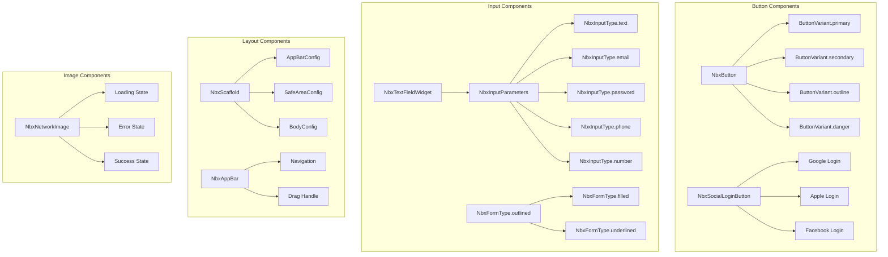
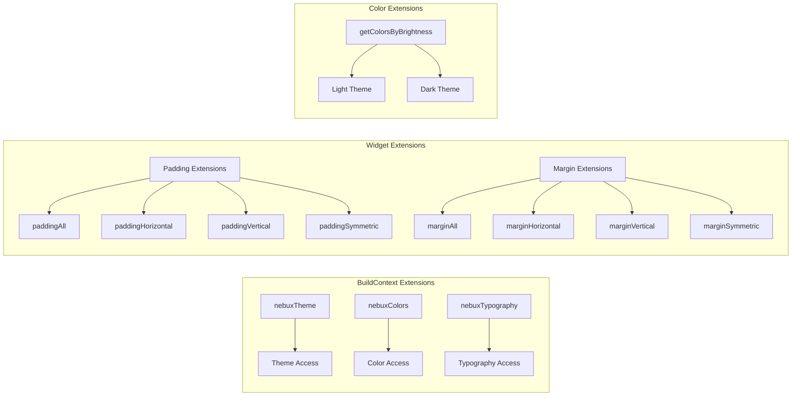
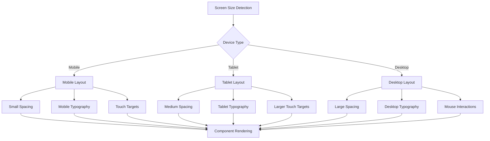
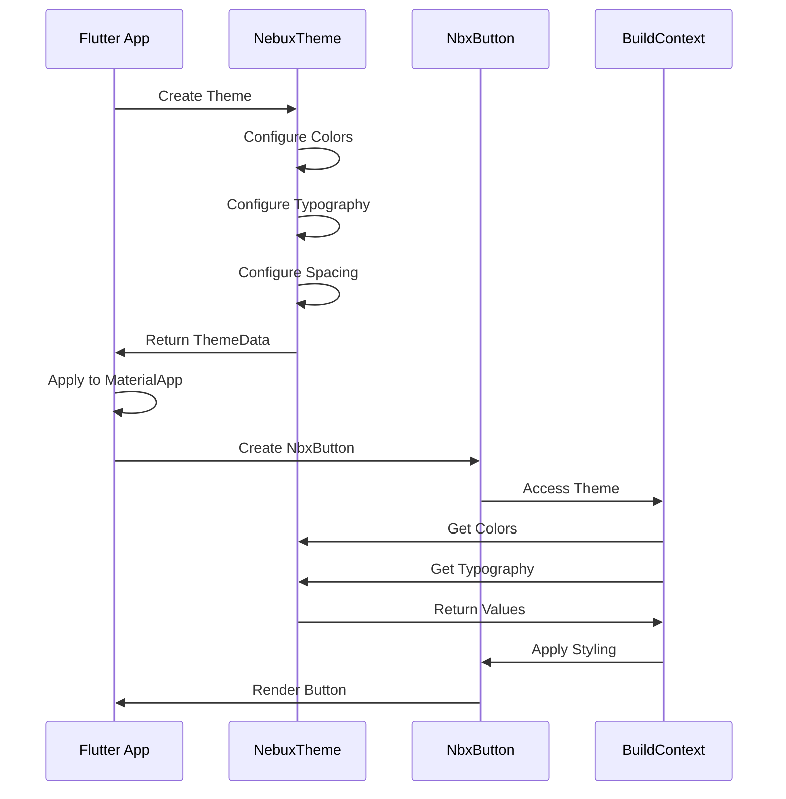
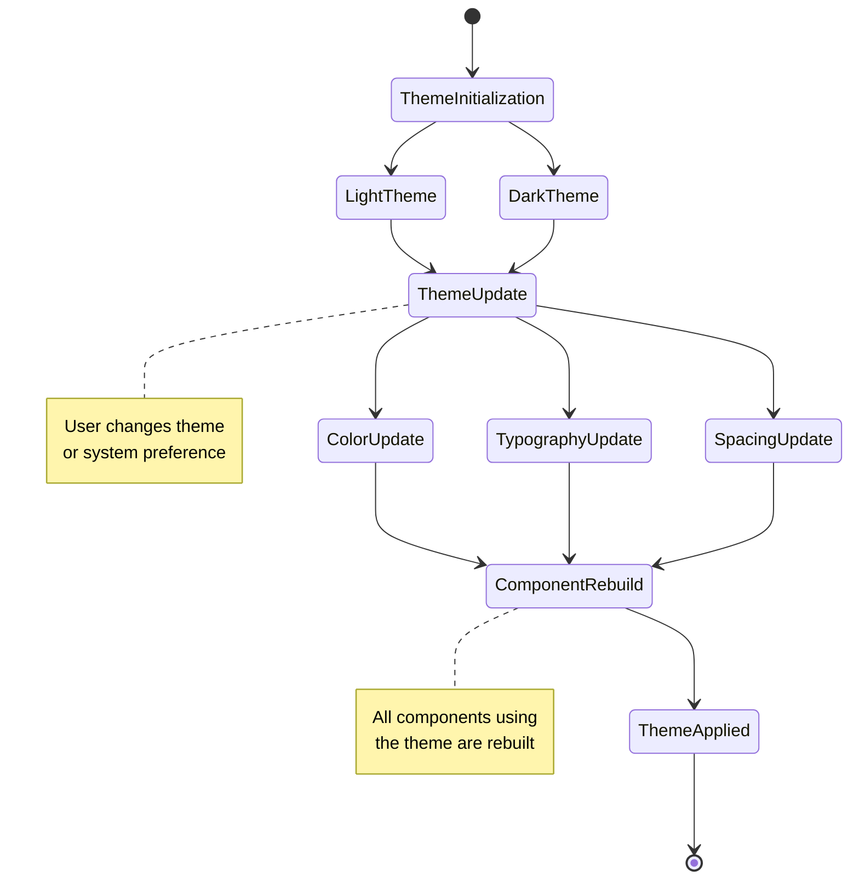
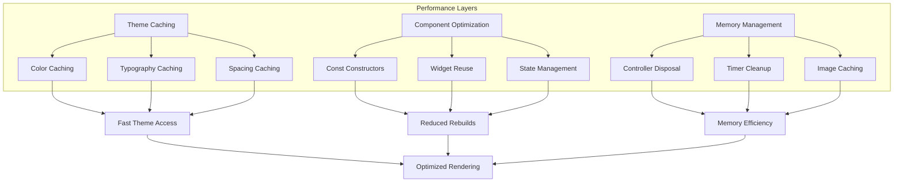
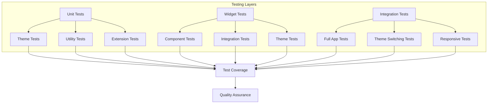
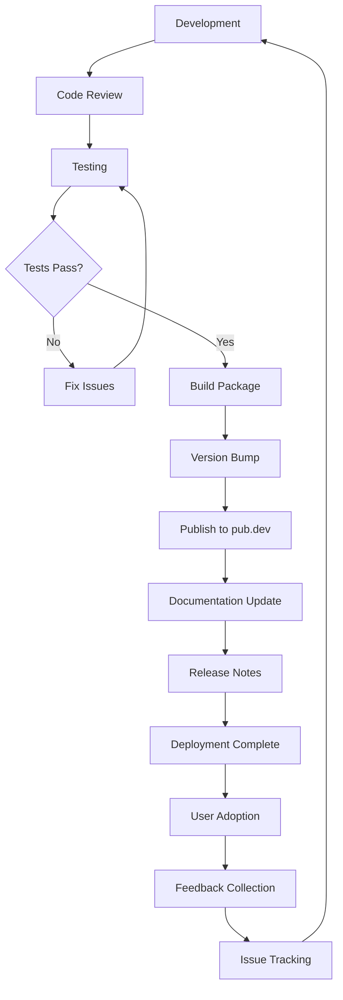

# Nebux Design System - Architecture Diagrams

## 🏗️ System Architecture

## 🎨 Theme System Flow

## 🧩 Component Hierarchy

## 🔧 Extension System

## 📱 Responsive Design Flow

## 🎯 Usage Patterns

## 🔄 State Management Flow

## 📊 Performance Optimization

## 🧪 Testing Architecture

## 🚀 Deployment Flow

---

**Note**: These diagrams are created using Mermaid syntax and can be rendered in any Mermaid-compatible viewer or documentation system.
