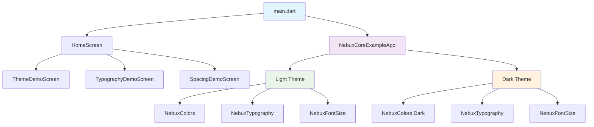
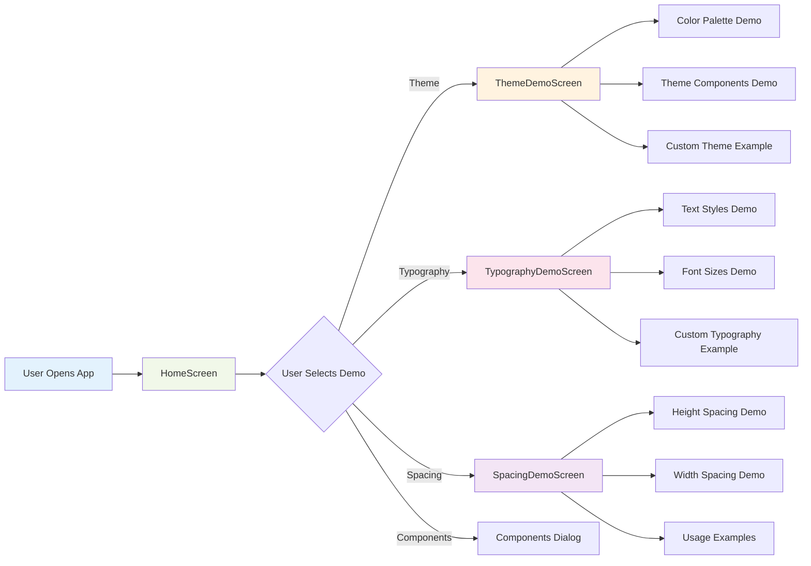
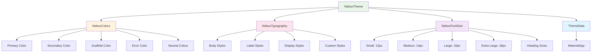
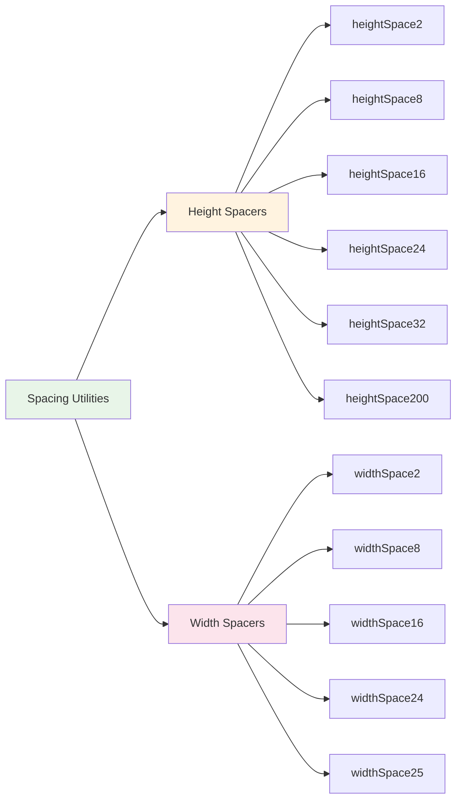
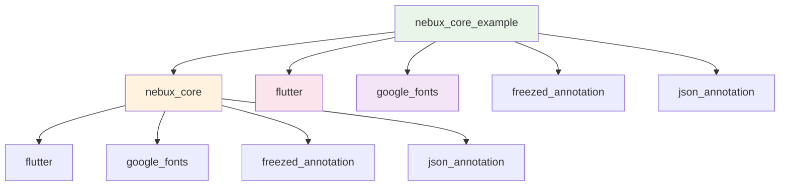

# NebuX Core Example Architecture

## App Structure Overview



## Component Flow



## Theme System Architecture



## Spacing System



## Key Design Principles

### 🎨 **Consistency**

- All UI components follow the same design language
- Consistent spacing, typography, and color usage
- Standardized component behavior and styling

### 🔧 **Modularity**

- Each screen demonstrates a specific aspect of the design system
- Reusable components and utilities
- Clear separation of concerns

### 📱 **User Experience**

- Intuitive navigation between different demos
- Clear visual hierarchy and information architecture
- Responsive design that works on different screen sizes

### 🎯 **Educational Value**

- Code examples with explanations
- Visual demonstrations of design system features
- Best practices and usage patterns

## File Organization

```
example/
├── 📁 screens/                    # Demo screens
│   ├── 🏠 home_screen.dart        # Main navigation hub
│   ├── 🎨 theme_demo_screen.dart  # Theme system showcase
│   ├── 📝 typography_demo_screen.dart # Typography examples
│   └── 📏 spacing_demo_screen.dart   # Spacing utilities
├── 🚀 main.dart                   # App entry point
├── ⚙️ pubspec.yaml               # Dependencies
├── 📖 README.md                   # Documentation
└── 🏗️ ARCHITECTURE.md            # This file
```

## Dependencies



## Development Workflow

1. **Setup**: Navigate to example directory and run `flutter pub get`
2. **Development**: Make changes to demo screens or add new features
3. **Testing**: Run the app with `flutter run` to see changes
4. **Documentation**: Update README.md and ARCHITECTURE.md as needed
5. **Contribution**: Submit pull requests for improvements

## Best Practices Demonstrated

- **Separation of Concerns**: Each screen focuses on one aspect of the design system
- **Code Reusability**: Common utilities and components are shared
- **Documentation**: Comprehensive comments and explanations
- **Accessibility**: Proper contrast ratios and readable fonts
- **Performance**: Efficient widget structure and minimal rebuilds
