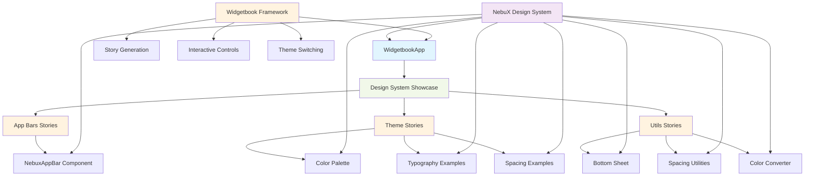
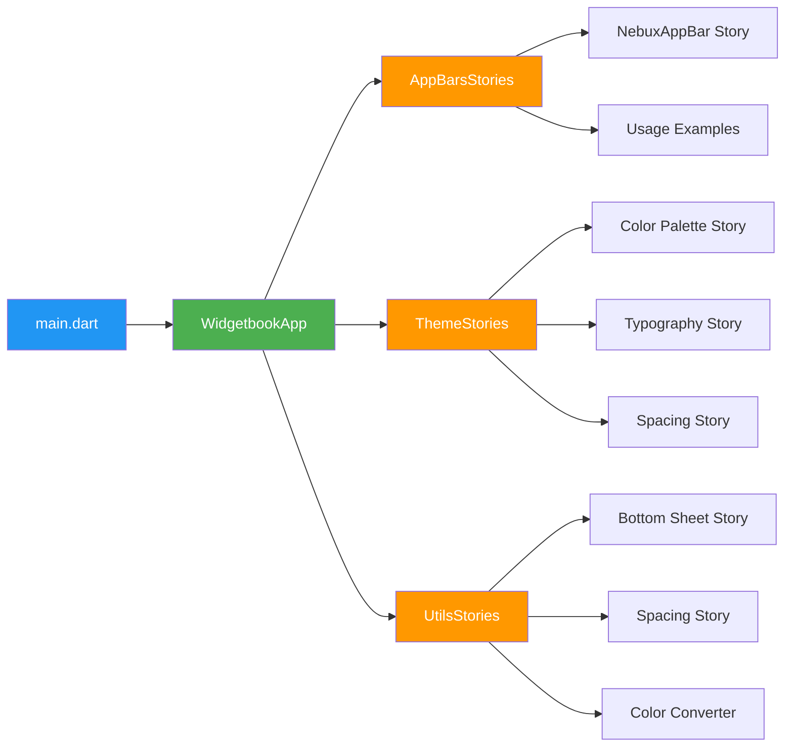
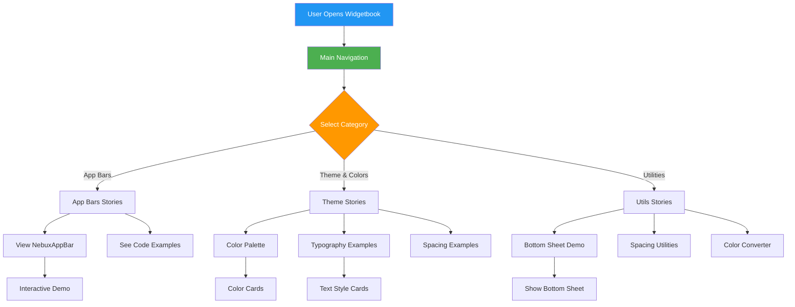
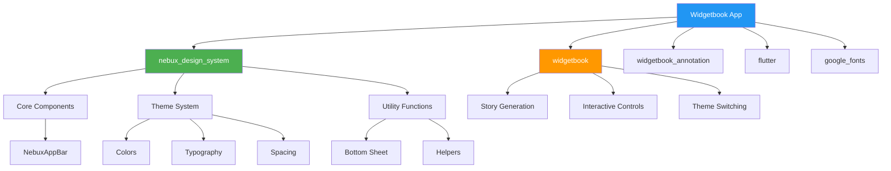
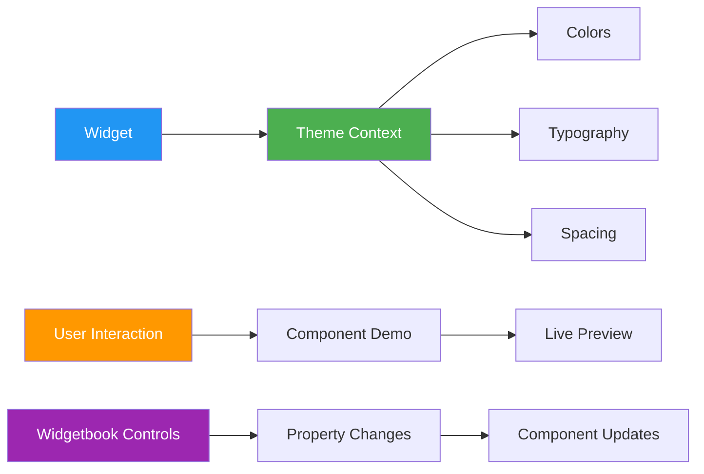
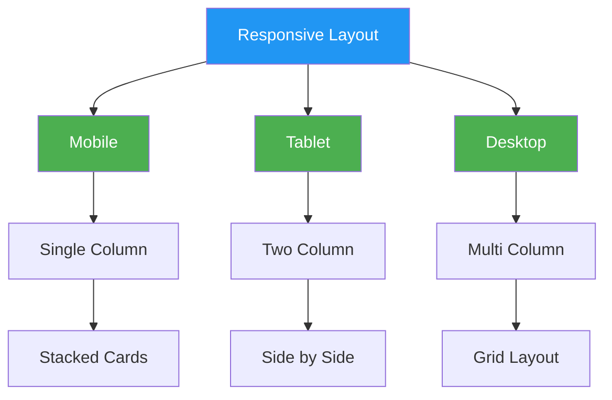
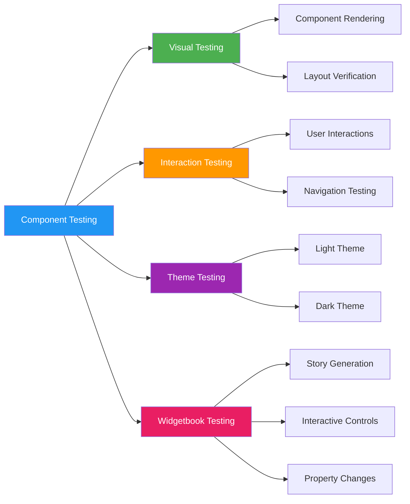
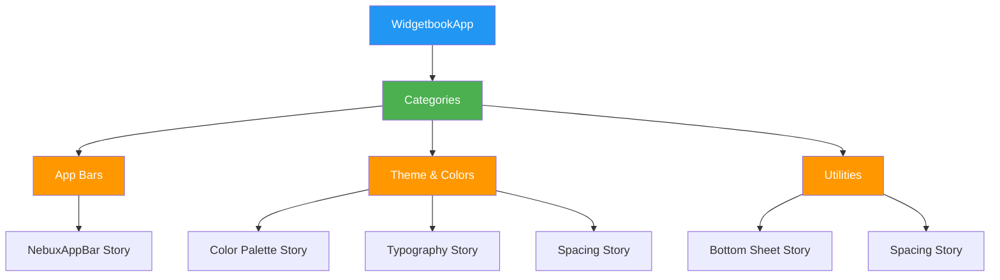

# NebuX Design System Storybook - Architecture

## 🏗️ Overall Architecture



## 📱 App Structure



## 🎨 Component Showcase Flow



## 🔧 Technical Implementation

### File Structure

```
nebux_core/example/
├── lib/
│   ├── main.dart                    # App entry point with WidgetbookApp
│   └── stories/                     # Component showcases
│       ├── app_bars_stories.dart    # App bar components
│       ├── theme_stories.dart       # Theme & colors
│       └── utils_stories.dart       # Utility components
├── pubspec.yaml                     # Dependencies
├── analysis_options.yaml            # Linting rules
├── README.md                        # Documentation
└── ARCHITECTURE.md                  # This file
```

### Dependencies



## 🎯 Design Patterns

### Widgetbook Story Pattern

Each story follows a consistent pattern:

```dart
@WidgetbookStory(name: 'Story Name')
class ComponentStory extends StatelessWidget {
  const ComponentStory({super.key});

  @override
  Widget build(BuildContext context) {
    return YourComponent();
  }
}
```

### Theme Integration

All components use the NebuX theme system:

```dart
final theme = context.nebuxTheme;

// Colors
theme.colors.primary
theme.colors.textPrimary

// Typography
theme.typography.heading
theme.typography.content

// Spacing
theme.fontSize.large
```

## 🔄 State Management

The Widgetbook app uses a simple state management approach:



## 📱 Responsive Design

The app is designed to work across different screen sizes:



## 🧪 Testing Strategy



## 🚀 Performance Considerations

- **Lazy Loading**: Components are loaded on demand
- **Theme Caching**: Theme data is cached for performance
- **Minimal Dependencies**: Only essential packages included
- **Efficient Rendering**: Optimized widget tree structure
- **Widgetbook Optimization**: Efficient story generation and navigation

## 🔒 Security & Best Practices

- **No Sensitive Data**: Storybook contains no real user data
- **Code Quality**: Follows Flutter best practices
- **Accessibility**: Components support accessibility features
- **Documentation**: Comprehensive inline documentation
- **Widgetbook Standards**: Follows Widgetbook best practices

## 🔄 Widgetbook Integration

### Story Organization



### Interactive Controls

Widgetbook provides knobs for interactive property control:

```dart
@WidgetbookStory(name: 'Interactive Component')
class InteractiveStory extends StatelessWidget {
  const InteractiveStory({super.key});

  @override
  Widget build(BuildContext context) {
    return YourComponent(
      // Properties can be controlled via Widgetbook knobs
    );
  }
}
```

---

This architecture ensures the Widgetbook app serves as both a showcase and a testing environment for the NebuX Design System components, with full integration of the Widgetbook framework for interactive component exploration.
